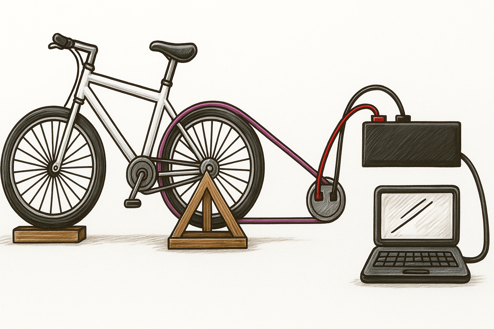

# Documentación del Proyecto: Sport ECO-POWR

## Problema
Cartagena enfrenta desafíos energéticos significativos: altos costos de electricidad, dependencia de fuentes no renovables y baja conciencia ambiental en espacios públicos de alto tráfico (gimnasios, hoteles, universidades). Al mismo tiempo, el sedentarismo afecta la salud de la comunidad.

## Solución
**Sport ECO-POWR** es un sistema híbrido que:
- Convierte bicicletas estáticas en **generadores de energía limpia** mediante tecnología de generación cinética.
- Integra una **plataforma digital** que gamifica el ejercicio, recompensa a los usuarios y muestra en tiempo real su aporte energético y ambiental.
- Reduce costos operativos para instituciones y empodera a la comunidad con hábitos sostenibles.

## Propuesta de valor
- **Para instituciones**: ahorro energético inmediato + diferenciación sostenible.
- **Para usuarios**: ejercicio recompensado + conciencia ecológica + comunidad activa.
- **Para la ciudad**: reducción de huella de carbono + alineación con los ODS.

## Modelo de negocio
1. **Venta directa**: Sistema completo (hardware + software).
2. **Arrendamiento operativo**: Pago mensual con mantenimiento incluido.
3. **Ahorro compartido**: Inversión conjunta con reparto de beneficios energéticos y digitales.

## Representación grafica 

